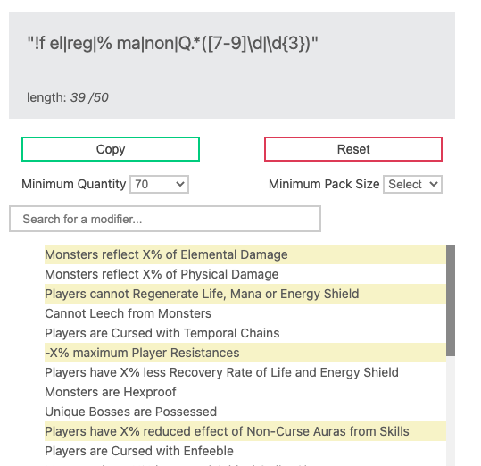
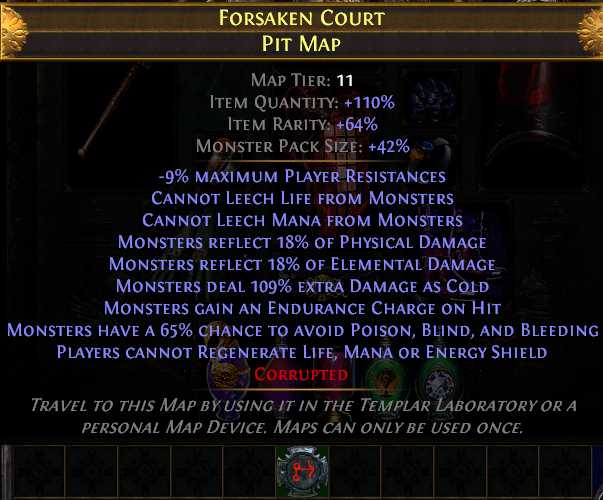

# Path of Exile Tools

This is a collection of web-based tools I have created for the game [Path of Exile](http://pathofexile.com) by Grinding Gear Games. Notes, method, and instructions for each individual tool are listed below. I'll do my best to give general descriptions where applicable, so hopefully the purpose will make sense to those that are not familiar with the game. 

## Table of Contents
1. [Map Mod Regex](#mapmod)
2. [Gem Vendor Regex](#gemvendor)
3. [Gem Campaign Locations](#gemlocations)

## Map Mod Regex 

This tool is an exercise to see if I could recreate a popular existing tool [poe.re](http://poe.re/#/maps), while also adding some of my own minor adjustments.

### Instructions

Search and select all the map mods that your build cannot run and the box at the top will populate with a shortened regex string that matches the selected mods. Your selected mods will be highlighted in yellow. 

Copy and paste this string into your PoE searchbar to highlight all the maps that match. Use Chaos Orbs or Scour/Alc to reroll until all maps in your tab are highlighted, and Vaal if you want (at your own risk). 
 
<i>Insert map rolling tab image here.</i>
 
Optionally add a minimum quantity and/or pack size value for more difficult and rewarding maps.

### Description

 Example Map

### Method

